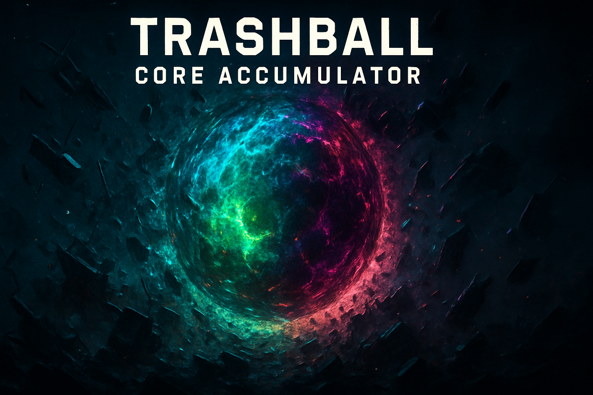

# 🗑️ Trashball: Core Accumulator

Hybrid idle/runner game where you grow a cosmic trashball to power yourself up and launch high-stakes salvage runs. Built with React, Three.js, and Zustand.
This is a work-in-progress prototype; expect rough edges, placeholder art, and frequent changes.

## 🚀 Concept: The Trashball's Ascent

You control a Core Accumulator—a massive orb that generates power by accumulating and compressing cosmic junk.

1.  **Generate Mass:** Charge the orb to generate **Mass** (your primary resource).
2.  **Launch Harvests:** Spend Mass to launch **Debris Harvest** runs (the mini-game).
3.  **Collect Salvage:** During the run, you collect junk (physical objects) which translates to **Salvage** (your upgrade currency).
4.  **Prestige:** When the Trashball reaches critical mass, you can **Prestige** to gain permanent Essence and restart with a stronger Core.

## 🎮 Core Gameplay Mechanics

### 1. The Core Accumulator (Idle Loop)

This is the main 3D orb scene where you accumulate power:

* **Charging:** **Hold the screen/mouse button** to charge the Core's energy vortex.
    * Higher **Vortex Power** (charge level) dramatically increases **Mass** generation per tick.
    * Releasing the hold allows the Vortex Power to slowly dampen down.
* **Mass (Energy):** This resource tracks the Trashball's overall size/power. It is spent to launch Debris Harvests and is the requirement for Prestige.
* **Physics:** The orb reacts to holding (Thrust) and releasing (Gravity/Damping) to create a satisfying, skill-based idle loop.

### 2. Debris Harvest (Runner Mini-Game)

The high-stakes mini-game where you earn your currency:

* **Goal:** Navigate the Trashball through space to **Collect green junk** (earn physical mass) and **Avoid red obstacles** (lose mass/shields).
* **Controls:**
    * **Hold:** Moves the Trashball into the **Outer Orbit**.
    * **Release:** Moves the Trashball into the **Inner Orbit**.
    * **Drag/Strafe:** Allows horizontal movement to target junk and dodge obstacles.
* **Rewards:**
    * **Trashball Mass:** The physical junk collected is temporarily attached to the Trashball.
    * **Salvage (Scrap):** The final score and collected mass from the run are converted into permanent Salvage currency.
    * *Tip: Launching the run with high Vortex Power grants a bonus Salvage multiplier!*.

## 🛠️ Progression and Upgrades

All upgrades are purchased using **Salvage** and are grouped into specialized categories:

### I. Core Density (Harmonic)
*Focuses on Mass/Energy generation.*

| Upgrade | Effect |
| :--- | :--- |
| **Core Compressor** (`resonanceTuner`) | Increases Mass generation rate per level. |
| **Critical Surge** (`criticalSurge`) | Chance to multiply a Mass generation tick when holding. |
| **Vortex Lock** (`orbitalStabilization`) | Reduces charge drain when released (more efficient idle). |

### II. Acquisition (Scavenger)
*Focuses on the Debris Harvest run's efficiency and defense.*

| Upgrade | Effect |
| :--- | :--- |
| **Junk Magnet** (`tractorBeam`) | Wider scrap pickup radius (larger Trashball hitbox). |
| **Shield Generator** (`shieldGenerator`) | Grants shield charges to ignore a hit from an obstacle. |
| **Afterburners** (`afterburners`) | Faster strafe speed in the Debris Harvest run. |

### III. Temporal (Chronos)
*Focuses on mission throughput and run time control.*

| Upgrade | Effect |
| :--- | :--- |
| **Warp Cooldown** (`warpCooldown`) | Reduces the launch cooldown timer for the Debris Harvest. |
| **Gravity Shift** (`timeDilation`) | Debris moves slower during the run, making collection easier. |

## 🏗️ Technical Structure

* `src/core`: Zustand store (`GameState.ts`) and upgrade definitions (`ScrapUnlocks.ts`).
* `src/orb`: 3D three.js scene for the Core Accumulator/idle loop (`OrbScene.tsx`).
* `src/scraprun`: Full-screen runner mini-game (`ScrapRunScene.tsx`).
* `src/ui`: Interface components (HUD, cooldown, Upgrade Panel).

## 🔨 Getting Started

1.  Install dependencies: `npm install`
2.  Start dev server: `npm run dev`

## Asset Credits

FBX garbage models were sourced from https://rojatzo.itch.io/garbage-assets.
Fast-food props come from https://dglopez.itch.io/low-poly-fast-food-asset-pack.
